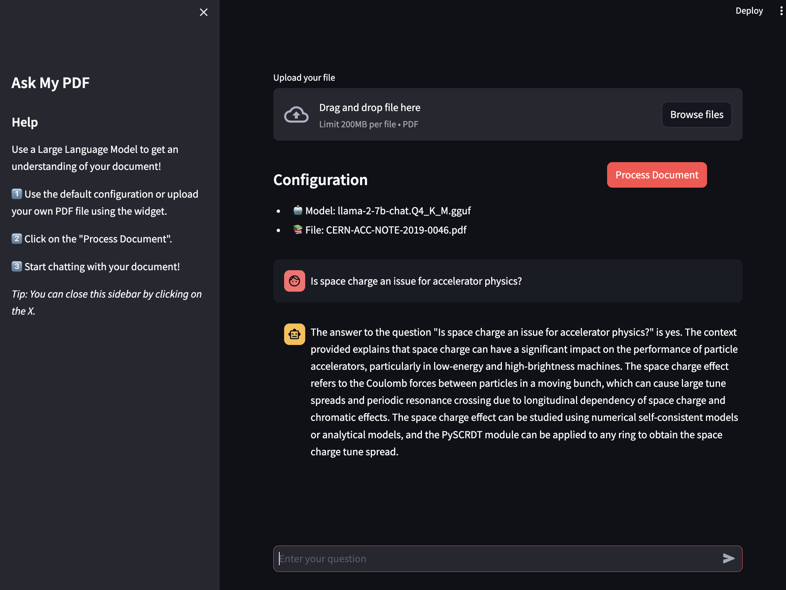

# AskMyPDF

## `AskMyPDF` is a RAG application to chat with your PDF.

### Description

Given a PDF, build a RAG chain and use a local LLM to ask questions relevant to the document

<p align="center">

</p>


### Purpose 

The application has been developed for experimentation and learning purposes.


### PreReqs

The app is built using
- `langchain_core` and `langchain_community` for the runnables
- `llama_cpp_python` to use compiled version of GGUF models (Llama-2, Mistral, etc)
- `chromadb` to store the vector embeddings
- `streamlit` to build the UI for the Human-AI QA interaction
- `dotenv` to load environment variables


### `.env` :: To Be Updated

To replicate the results create a `.env` file in the `src/` having the variables
```bash
MODEL_PATH="<PATH_TO_YOUR_MODEL_DIR>"

MODEL_NAME="${MODEL_PATH}<NAME_OF_YOUR_MODEL_FILE>"

PDF_PATH="<LOCAL_PATH_TO_/asset_FOLDER>"

TEMP_PDF="<TITLE_OF_YOUR_PDF_DOC>"
```